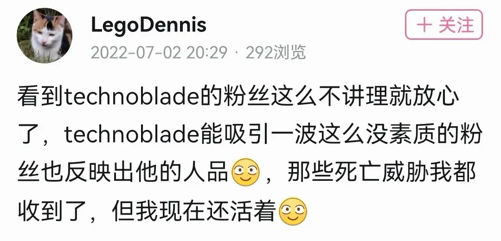

# 起因  

有因才有果，先了解一下事情的发生原因。
  
## 大起因  

2022年7月1日，著名MCYT，**Technoblade去世**。  

  

*Technoblade*在MC圈子中颇负盛名，他的影响力在外国毫不逊色于*Dream*。他的去世可以说使得国内外掀起了悼念*Technoblade*的热潮。  

在悼念的时候，有些人为了**流量、钱**，大量发布假意悼念视频。不用说是谁，我想你多少见过一些。  

## 直接原因  

以下内容转自[UID1419577662的动态](https://t.bilibili.com/686070529623326724?spm_id_from=333.999.0.0)，无论如何，**请理性看待！**  

以上就是事件导火索，尤其是那句

> 谁在乎，死了就死了，人生来就是要死的  

下节展开对以上内容的讨论。